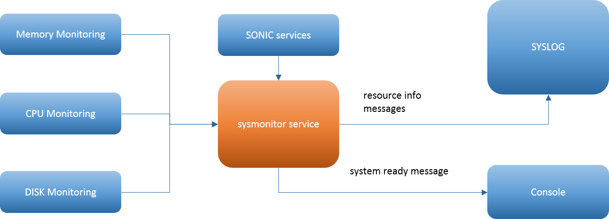

# System Resource Monitoring

System Resource Monitoring Enhancements.

# High Level Design Document

#### Rev 0.1

# Table of Contents
  * [List of Tables](#list-of-tables)
  * [Revision](#revision)
  * [About This Manual](#about-this-manual)
  * [Scope](#scope)
  * [Definition/Abbreviation](#definitionabbreviation)
  * [Feature Overview](#FeatureOverview)
  * [Requirements](#Requirements)
  * [Design](#Design)
  * [Unit Test](#UnitTest)

# List of Tables
[Table 1: Abbreviations](#table-1-abbreviations)

# Revision
| Rev |     Date    |       Author       | Change Description                |
|:---:|:-----------:|:------------------:|-----------------------------------|
| 0.1 | 04/12/2019  |   Kalimuthu        | Initial version                   |

# About this Manual

This document provides general information about the System Resource Monitoring Enhancements feature implementation in SONiC.

# Scope

This document describes the high level design of System Resource Monitoring Enhancements feature. 

# Definition/Abbreviation

### Table 1: Abbreviations
| **Term**                 | **Meaning**                         |
|--------------------------|-------------------------------------|
| ODM                      | Original Design Manufacturer        |
| RSS                      | Resident Set Size

# 1 Feature Overview

As SONiC runs on different ODM platform hardware configurations, it becomes necessary to have a monitoring framework that is native to SONiC to monitor the usage of system resouces and software service state and generate  the syslog alert when it reaches a certain threshold . However, it should be noted that the scope of this framework is limited to monitoring and generating the syslog alert. The user can take the corrective measures in the context of the SONiC OS. 

## 1.1 Requirements
  
### 1.1.1 Functional Requirements

 - The monitoring framework should monitor both hardware and software resouces in the  Sonic system
 - The hardware resource monitoring should include CPU, physical memory
   and disk usage. 
 - The software resource monitoring should include  process, docker and
   core systemd services in the system
 - It should monitor and report the resource usage  through system syslog message
 - The system monitoring framework should run as a separate service and it should get lanched automatically during bootup.  System monitoring service should be  started by default. 
 - It should support three levels of threshold limit for each resource type
 - It should generate syslog message with log level as INFO, WARNING and CRITIAL for respective threshold levels.
 - The resource threshold limit should be drived from the respective resource type and its system configuration.
 - Resource monitoring interval should be derived from the system platform configration
 - Only one syslog message should be generated when the resource usage crosses the threshold limit.
 - The framework should also support the custom action handler so that applications can dump message specific to the  resource limit and the resource type.

Resouce Monitoring
 - CPU Monitoring
	 - Generate the syslog alert with process stats when its usage crosses the threshold limit.
	 - CPU threshold shall be  predefined as  70%, 80%, 90%.
 - Memory Monitoring
	 - Generate the syslog alert with proceess memory stats when its usages crosses the threshold limit.
	 - Memory threshold shall be predefined as 70%, 80%, 90%
	 - Per process memory monitoring
		 - Generate the syslog alert with proceess memory stats when its usages crosses the threshold limit.
		 - Memory threshold shall be predefined as 30%, 40%,  above 50% of system memory.

 - Disk Partition Monitoring
	 - Generate the syslog alert with partition stats when its usages crosses the threshold limit.
	 - Disk threshold shall be predefined as 70%, 80%, 90%
	 - 
 - Service Monitoring
	 - It should monitor the core systemd services and generated the syslog for system ready state.
	 - Generate  'system ready' syslog message when all the core services are up and port initailation is done.
	 - Generate 'system not ready' syslog message when one of the service goes down. 
 

### 1.1.2 Configuration and Management Requirements

 - Threshold levels are dervied from the system configurations.

### 1.1.3 Scalability Requirements
   NA
### 1.1.4 Warm Boot Requirements
  NA
# 2 Design
## 2.1 Overview

Sysmonitor framework monitors various software and hardware resources in the SONIC system.  There would be three levels of threshold limit defined for each of the resource type. It checks resource usage with its predefined threshold limit and generates the syslog alert message along with resource stats information.  When usage stays at the same level, it  generates only one syslog message for each level. 

The framework supports both software and hardware resource types.  It includes the three major hardware resource types as CPU, Memory and Disk partitions and the software resource types as systemd core services.  

## 2.4 SYSLOG Levels 

The syslog alert message and related statistics are forwarded to syslog messaging system. The following three levels of syslog shall be supported 

	Level1  - INFO 
	Level2 -  WARN
	Level3 - CRITICAL
 
## 2.3 Threshold Limit

 The resouce limits are automitcally dervied from the system configurations.  By default, the threshold limit defined as three levels and each of the level maps to corresponding syslog levels.
  
	  Level1 - 70% - INFO
	  Level2 - 80% - WARN
	  Level3 - 90% - CRITICAL
 
 There are thresholds  that are specific to the particulate resource would be defined under the resouce type. 

## 2.4 Sampling Interval

   By default, the sampling interval is set to 3 minutes which indicates that every 3 minutes resource usage being monitored and checked against the threshold. The sampling interval is fixed by default and it gets adjusted based on the system resource configuration.
      
#### System Service Monitoring:
   
   In sonic, it is essential know the current state the system whether the system is ready to handle all the config commands or not.  If one of the core services are down, there should be way to identify the system state that it is not ready to take the config commands.  The sysmonitor framework monitors the system core services and port initialization state and generate the system ready message. If one of the system core service goes down,  it alerts that the 'system not ready' message because  the service is not ready to handle the  config commands.  The system ready state message is sent to both syslog as well as console session so that user would know the live state on the console.
  
  The system core services includes  'swss',  'bgp',  'teamd',  'pmon',  'syncd' and  'database'. Other service can be added to list when it expands its core list.
It also monitors the docker services. If any of the docker service goes up/down, it checks the state of system and report log accordingly.

- #### Example
		   - Dec 10 08:35:48.817550 System is ready
  
#### Memory Monitoring

Memory is a critical resource in the system. It is essential to monitor the memory usage  at the system wide as well as per process level and report the usage accross the system. This helps to indentify memory distribution accross system, the spike in the memory allocation and also if there is any memory leaks in the process. 

The framework  monitors the memory usage at system level as well as per process level. Threshold is defined for both per process level and system level.  

#### System Memory Usage: 

  Memory usage of overall system is being monitored with predifined threshold.  When the usage crosses the threshold limit, syslog message is being generated.  Syslog message is generated with following information.

 - Overall system memory usage information
 - Memory usage information of all runnings processes 
	 - Process name, 
	 - Process Id, 
	 - Used memory size.

##### System Memory Threshold Limit 
The resouce limits are automitcally dervied from the system configurations. 

 -  Overall memory usage  thresholds are drived from the system memory
	- INFO -  70%  of system memory
	 - WARN -  80%  of system memory
	 - CRITICAL -  90%  of system memory
	
Memory usage of resource is dumped on the console with the following format:

- Process name, Process ID, RSS( physical memory)
 
 #### Example :
	- Dec 11 13:06:19.397949 sonic INFO system#state: System memory usage is above 60%, Total: 15.6G, Free: 1.8G, Used: 2.8G, Buffers: 314.8M, Cached: 10.7G
	- Dec 11 13:06:19.477884 sonic INFO system#state: MEM :: Name: orchagent, Pid:6269, Rss:10.5M
	- Dec 11 13:06:19.477951 sonic INFO system#state: MEM :: Name: ospfd, Pid:11029, Rss:10.5M
	- Dec 11 13:06:19.478011 sonic INFO system#state: MEM :: Name: redis-server, Pid:1006, Rss:10.6M
	- Dec 11 13:06:19.478060 sonic INFO system#state: MEM :: Name: zebra, Pid:9625, Rss:11.3M
	   
#### Per Process Memory Usage:

  When  per process memory usage goes beyond threshold limit, should also generate the process memory usage info on the system log message. The message is generated with the following information.
  
 - Memory info of a process 
	 - Process name, 
	 - Process Id
	 - Rss - Used memory size.
	  
##### Per Process Memory Threshold Limit 
  
 - Per process usage Memory threshold is derived from the overall system memory
	 - INFO - 30%  of system memory
	 - WARN - 40%  of system memory
	 - CRITICAL - above 50% of system memory 

#### Example
	 - Dec 11 13:03:19.209233 sonic INFO system#state: Per process memory threshold exceeded for process rest_server[3781], threshold 3% of system memory 478.6M, current usage 538.2M
	 - Dec 11 13:03:19.242928 sonic INFO system#state: Per process memory threshold exceeded for process syncd[14083], threshold 3% of system memory 478.6M, current usage 515.3M

#### CPU Monitoring:

CPU usage of all the process in the system is being monitored.  When the usage crosses the threshold, syslog message is being generated.  Syslog message is generated with following information.

- Process info:
	- Process Name
	- Process Id
	- CPU usage Time
   

##### Per Process CPU threshold limits:

-  The CPU threshold limit is considered as duration of sampling interval in which the process high CPU condition detected.

	- INFO -  70%  of High CPU
	 - WARN -  80%  of  High CPU
	 - CRITICAL -  90%  of High CPU

#### Disk Partition Monitoring:

   In a long running network environment,  monitoring the disk parition usage is a crucial process. As a network operating system, disk partitions mainly used for storing the log files, core dumps,  debug infos, application files, config files and OS images. It is essential to keep track of the disk partition usage. There would be many fils usage of overall system is being monitored.  When the usage crosses the threshold, syslog message is being generated.  Syslog message is generated with the following information.

Disk Parition Usage:

 - Overall partion usage thresholds are dervied as 
	- INFO -  70%  of partition size
	 - WARN -  80%  of  partition size 
	 - CRITICAL -  90%  of partition size
	 

## 2.5 Resource DB

Monitoring framework has a self contained python database for maintaining the state of each resources.  The duration and number of entries for a resouce is automatically tuned based on the system resource configuration.

## 2.6 Tech-Support 

All the resource statististics and usage alerts are forwarded to syslog.  The syslog is automatically monitored by the logrotate framework. During the techsupport data collection, all the syslog data added as part of the tech-support data archive.

# 3 Unit Test

|SNO|  Testcase                                     |  Result |
|---|-----------------------------------------------| ------- |
| 1 | Simulate and verify the overall memory usage when it goes above threshold |   |
| 2 | Verify the per process memory usage and check the syslog alert || 
| 3 | Verify the high CPU condition of a process and check the syslog alert | |
| 4 | Verify the disk partition usage and check thesyslog alert |  |
| 5 | Verify the system service status and check for system ready message | |
| 6 | Simulate the system services failure and check for the system not read message ||

<!--stackedit_data:
eyJoaXN0b3J5IjpbMTg3NzU5ODM2NCwtMTgyODc4ODYwOCw2NT
U5NTM4NjUsLTEyNzE3NDI0ODYsLTM0MDY5NTUyNiwtODAwNTE4
MzQ2LDczNjUxNDY4MSwtNjkxNTMwODEzLDE0Mjk3NjM0NjksLT
EzNTYwNDIxODIsNDAxNDI3MTY0LDEwNTUyNzQ2ODQsMTM3MDY3
Nzg5LDcyNzY0NjM4MCwxMzI4OTkyMzA5LC0xNzgyMDc5ODcyLD
E3MjQzMjM1MSwtMTgzNzc3MTE0NCwxNDY1MTIxMzg5LC00MzAy
MzUyNDddfQ==
-->