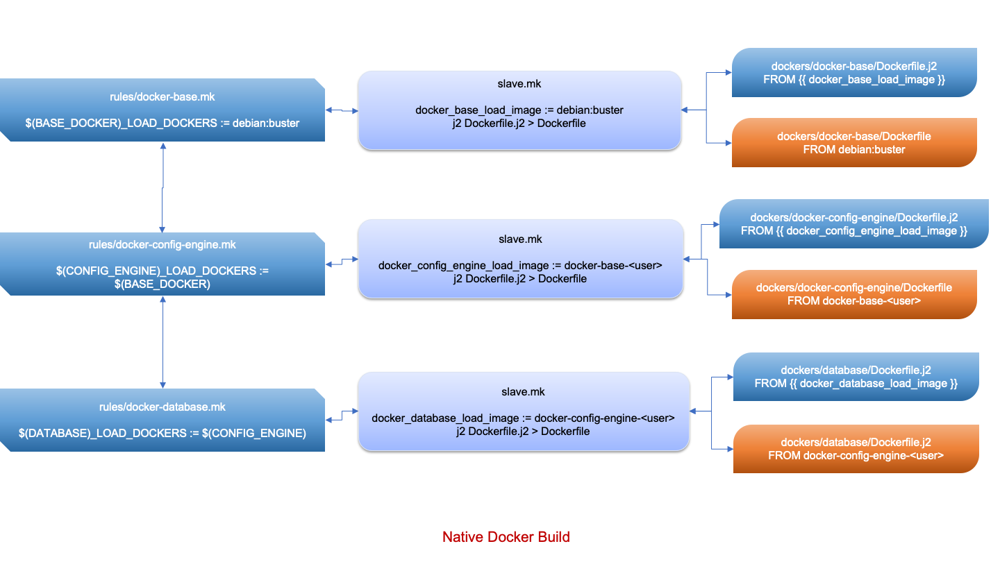
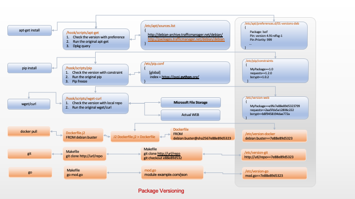
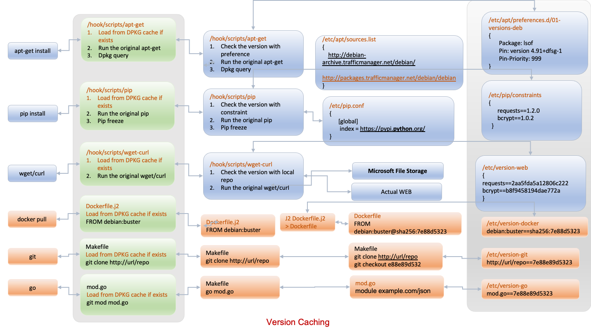
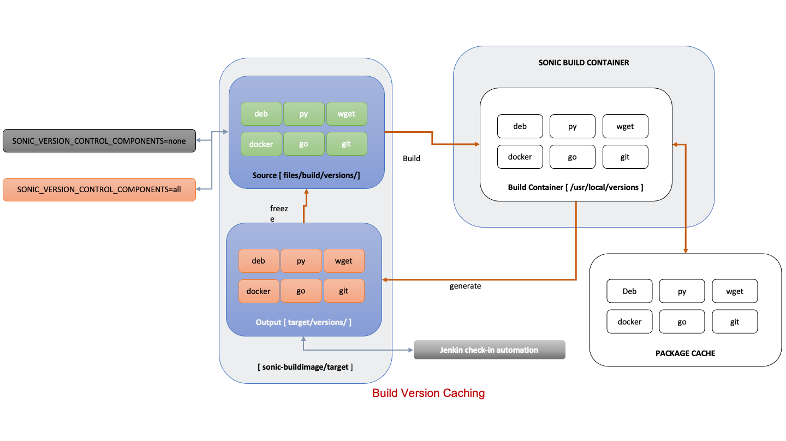
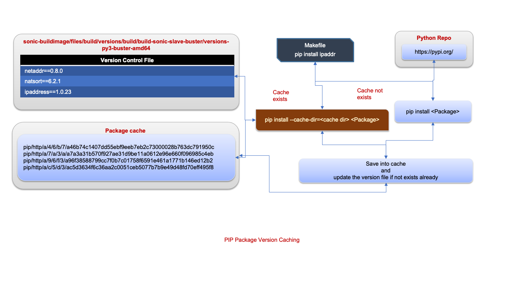
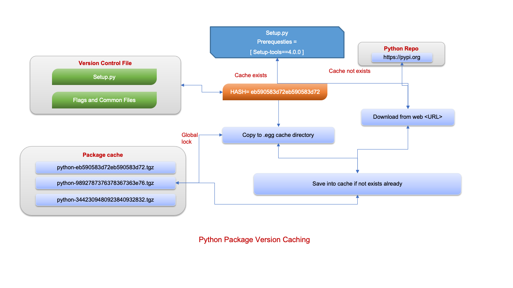
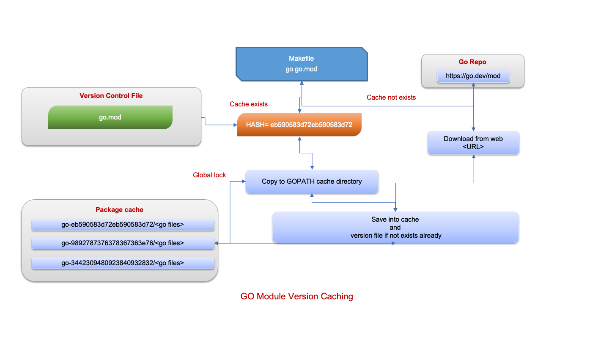
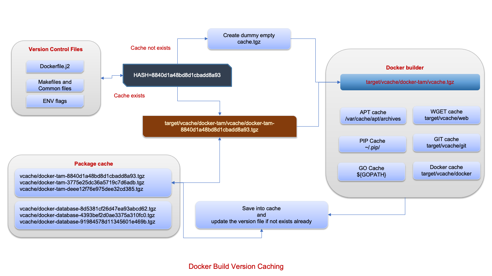

# Build Improvements HLD

#### Rev 0.2

# Table of Contents

- [List of Tables](#list-of-tables)
- [Revision](#revision)
- [Definition/Abbreviation](#definitionabbreviation)
- [About This Manual](#about-this-manual)
- [Introduction and Scope](#1-introduction-and-scope)
  - [Current build infrastructure](#11-existingtools-limitation)
  - [Benefits of this feature](#12-benefits-of-this-feature)
- [Feature Requirements](#2-feature-requirements)
  - [Functional Requirements](#21-functional-requirements)
  - [Configuration and Management Requirements](#22-configuration-and-management-requirements)
  - [Scalability Requirements](#23-scalability-requirements)
  - [Warm Boot Requirements](#24-warm-boot-requirements)
- [Feature Description](#3-feature-description)
- [Feature Design](#4-feature-design)
  - [Overview](#41-design-overview)
  - [Docker-in-Docker build](#42-db-changes)
  - [SONIC version cache build](#42-db-changes)
  - [Installer Image Optimization](#42-db-changes)
- [Serviceability and Debug](#6-serviceability-and-debug)
- [Warm reboot Support](#7-warm-reboot-support)
- [Unit Test Cases ](#8-unit-test-cases)
- [References ](#9-references)

# List of Tables

[Table 1: Abbreviations](#table-1-abbreviations)

# Revision
| Rev  |    Date    |       Author        | Change Description                                           |
|:--:|:--------:|:-----------------:|:------------------------------------------------------------:|
| 0.1  |  | Kalimuthu Velappan      | Initial version                                              |


# Definition/Abbreviation

### Table 1: Abbreviations

| **Term** | **Meaning**                               |
| -------- | ----------------------------------------- |
| DPKG     | Debian Package                            |
| DinD     | Docker-in-Docker                          |
| DooD     | Docker-out-of-Docker                      |


# About this Manual

This document provides general information about the build improvements in SONiC. 


# Introduction and Scope

This document describes the Functionality and High level design of the build improvement in SONiC.

- The current SONiC environment uses container environment for generating the sonic packages, docker container images and installer images with rootfs.
- On every soonic build, it downloads source code, binary packages, docker images and other tools and utilities from an external world and generates the build artifacts.
- Inter-dependency between the targets could prevent the build parallelism and cause more delay in the overall build time.
- Nested build container would slowdown the Hardware resource access - CPU, memory, Network and Filesystem.


This feature provides improvements in three essential areas.
- Parallel build
	- Parallel build using Native docker mode.
	- OverlayFS to virtualize the build root.
- Build time Optimization
	- Parallel make jobs - Passing dh '-parallel' flags to all the build targets.
	- Binary image build optimization
	- Use tmpfs and OverlayFS to speed up the build process.
- Build caching
	- Version cache - Package cache support for build componets that are downloaded from external world.
	- Image cache support for installer image componets. 

Reference:
- Version caching feature is enhanced on top of DPKG caching and Versioning framework.
Ref:
	- [https://github.com/Azure/SONiC/blob/master/doc/sonic-build-system/DPKG%20caching%20framework%20.ppt](url)
	- [https://github.com/xumia/SONiC/blob/repd3/doc/sonic-build-system/SONiC-Reproduceable-Build.md](url)

# Feature Requirements
 - Feature should support build improvements in overall SONiC build.
 - Enhances the build to run in more parallel mode and optimize the time consuming build paths.

## Functional Requirements

Following requirements are addressed by the design presented in this document:

- Multiuser mode support:
    - Add a feature in the build infra to support the multiuser container build using native docker mode. 
	- Option to enable/disable the Native docker mode.
	- Use Jinja template to render the per user sonic Dockerfile.j2
	- Use OverlayFS to virtualize the build root to resolve inter target dependency.
   
- Build optimization:
    - Build optimizatoin for binary image generation.
	- Pass dh '-parallel' option to all the make targets.
    - Add caching support for binary image.
    - Add support for build time dependency over overlayFS support.
	- Use tmpfs and OverlayFS to speed up the per target build process.
    
- Caching Requirements:
    - Sonic image is built by pulling binary and source components from various sources.
        - Debian repo, python repo, docker repo, http(s) repo and go module repo.
        - Requires flexibility to select the different versions of a component.
    - Sonic development is diverged into multiple development branches.
        - Each development branch needs different version of build components.
    - Sonic moves to latest after every release. 
        - Release branch needs fixed version of build components as the prebuilt binary and source packages are keep moving to the latest version
    - Requires Caching/Mirroring support.
        - Component changes outside the SONIC repo which causes frequent build failures.
        - Unavailability of external side causes the dependency build failure. 
        - Flexibility to switch between fixed version vs  latest version.
    - Different branch can freeze different set of versions.
        - Still, Individual package should be upgraded to selected versions. 
    - Versions cache should be enabled/disabled globally.
    - Unavailability of external sites should not cause the dependency build failures.


## Configuration and Management Requirements

NA

## Scalability Requirements

NA

## Warm Boot Requirements

NA 


# Feature Description

This feature provides build improvements in SONIC.

# Feature Design
## Design Overview
## Parallel Build
### Native docker mode
- Docker supports two types of mode to run a container.
    - Docker-in-Docker(DinD) mode
    - Native Docker or Docker-out-of-Docker(DooD) mode

- Docker-In-Docker mode.
    - Installing and running another Docker engine (daemon) inside a Docker container.
    - Since Docker 0.6, a "privileged" option is added to allow running containers in a special mode with almost all capabilities of the host machine, including kernel features and devices acccess.
    - As a consequence, Docker engine, as a privileged application, can run inside a Docker container itself.
    - Docker-in-Docker solution is not recommented, especially in containerized Jenkins systems as potential problems include 
        - Security profile of inner Docker will conflict with one of outer Docker 
        - Incompatible file systems (e.g. AUFS inside Docker container).
    - As a workaround to address these problems using:
        - Container creation using dind docker solutions.
	    - To use AUFS in the inner Docker, just promote /var/lib/docker to inner docker.
	- Apart from the security aspect, a lot of performace panaliteis are involved as it uses the UnionFS/OverlayFS that degrades the performace when number of lower layers are more. 
    - All the child container resource usage is restricted within the paraent container usage. 

- Native docker mode.
    - The DoD mode uses socket file(/var/run/docker.sock) to communitcate with host dockerd daemon.
	- It uses the shared socket file between HOST and the container to run the build container.
	    -  Eg: docker run -v /var/run/docker.sock:/var/run/docker.sock ...
	- When a new docker container/builder/composer is invoked from a build container:
        - It is started as a sibiling to build container. 
        - It will run in parallel with build container.
	- This mode provides a better performance as it can utilize the full potential of host machine.

#### Build Container in SONiC:
- The current SONiC build infrastructure generats all the SONiC build artifacts inside the docker container environment. When docker is isolated from the host CPU, the docker resource usage and filesystem access are restricted from its full capacity. Docker isolation is more essential for application containers, but for the build containers, the more essentail requirement is the build performace rather than adopting a higher security model. It provides the better build performance when the build containers are run in native mode. 
- Sonic supports both the mode of build container creation. 
- The Native docker mode gives better performace but it has some limitations:
    - In a shared build servers, sonic docker creation from multiple user would give conflict as it shares the same docker image name.
- This feature addresses:
    - Sonic docker container creation in parallel from multiple users.
	- Since it runs as sibiliing container, it will provide better container performace. 
	- As it shares the host dockerd, it gives better performance as the multilevel UNIONFS/OverlayFS is not needed.

#### Build Container in SONiC:





- Currently, the build dockers are created as a user dockers(docker-base-stretch-, etc) that are specific to each user. 
- But the sonic dockers (docker-database, docker-swss, etc) are created with a fixed docker name and that are common to all the users.

    - docker-database:latest
    - docker-swss:latest

- When multiple builds are triggered on the same build server that creates parallel building issue because all the build jobs are trying to create the same docker with latest tag. This happens only when sonic dockers are built using native host dockerd for sonic docker image creation.

- This feature creates all sonic dockers as user sonic dockers and then, while saving and loading the user sonic dockers, it rename the user sonic dockers into correct sonic dockers with tag as latest.

- Docker image save sequence protected with lock as bellow,
	- docker_image_lock()
	- docker tag docker-name-<user>:latest docker-name:latest
	- docker save docker-name:latest > docker-name-<user>.gz
	- docker rm docker-name:latest
	- docker_image_unlock()

- Docker image load sequence protected with lock as bellow,
	- docker_image_lock()
	- docker load -i < docker-name-<user>.gz
	- docker tag docker-name:latest docker-name-<user>:latest
	- docker rm docker-name:latest
	- docker_image_unlock()

- The user sonic docker names are derived from '_LOAD_DOCKERS' make variable and using Jinja template, it replaces the FROM docker name with correct user sonic docker name for loading and saving the docker image.

- The template processing covers only for common dockers, Broadcom and VS platform dockers. For other vendor specific dockers, respective vendors need to add the support.

### Target Specific Build Root ( Experimental )

- OverlayFS allows multiple virtual rootfs creation for target specific build.
- Virtual bulid root - Merging the container root(/) and SONiC source(/sonic) and mounted into target specific virutal build root using OverlayFS.
- Use tmpfs mount for better performance.
- This would avoid the target specific(UNINSTALLS) and improve the parallel build performance.

    - \# mkdir -p BUILD
	- \# mkdir -p BUILD
	- \# mount -t tmpfs -o size=1G tmpfs BUILD  (optional - performace)
	- \# mount -t overlay overlay -olowerdir=/,upperdir=/sonic/,workdir=BUILD/work BUILD/sonic-buildimage/
	- \# chroot BUILD/sonic-buildimage/ /bin/bash
	- bash# mount -t proc proc /proc
	- bash# dpkg -i <pkg> && make <target>

### Parallel Make
	- Propogate the DEB_BUILD_OPTIONS='--parallel' to all it sub target.
	- Progation of parallel option to python pip install packages through ENV export.

## Version cache support

### Version components

- Sonic build downloads lots of component from external web which includes
    - Source code files
    - Prebuilt debian packages
    - Python PIP packages
    - Git source code
    - Docker images
    - Go modules
    - Other tools and utilities
    
- These components are getting updated fequently and the changes are dynamic in nature.
- Versioning feature support the sonic build to particular version of the package to be downloaded/installed.
- Versioning ability to select the particular package version, but still it will fetch the package from external world.
- When external site is down, selected package version is not available or any other issues with connecting to external site or downloading the package would lead to sonic build failure. 
- Due to this dynamic nature, every sonic build might have to change its dependency chain.
- Version files are stored at files/build/versions folder as below hierarchy.
```
files/build/versions/
├── build
│   ├── build-sonic-slave-buster
│   │   ├── versions-deb-buster-amd64
│   │   ├── versions-py2-buster-amd64
│   │   └── versions-py3-buster-amd64
├── default
│   ├── versions-docker
│   ├── versions-git
│   └── versions-web
├── dockers
│   ├── docker-base-buster
│   │   ├── versions-deb-buster-amd64
│   │   ├── versions-py3-buster-amd64
│   |   ├── versions-git
│   |   ├── versions-web
    ...
```´



### Version Cache feature
- The version cache feature allows the sonic build system to cache all the source, binary and its dependencies into local file system.
- When version cache feature is enabled, first it checks local cache storage for requested package, if it is available, it loads from the cache else it will download from the external web.



### Build Version Design
- Version control files are copied to 
    - To slave container for package build.
    - To docker builder for sonic slave docker creation.
    - To docker builder for sonic docker creation.
    - To Rootfs for binary image generation.
    


- Based on the package version, corresponding file will be fetched from the cache if exists.
- Otherwise the file will be downloaded from the web and cache will be updated with newer version.
- Version cache feature supports caching for following build components.
    - DPKG packages
    - PIP packages
    - Python packages
    - Wget/Curl packages
    - GO modules
    - GIT modules
    - Docker images

#### Debian version cache

   - Debian packages are version controlled via preference file that specify each package and corresponding version as below.
	   - iproute==1.0.23
	- When deb package gets installed, it looks for the package version from the version control file. If matches, it installs the package with the specified version in the version control file.
	- During the package installation, it also save the package into the below cache path.
		- /var/cache/apt/archives/		
	- If package is already available in the cache path, then it directly installs the package without downloading from the external site.
	- With the version cache enabled, it preloads all cached packages into deb cache folder, so that any subsequent deb installation will always use the cached path.
 


#### PIP version cache
   - PIP packages are version controlled via constraint file that specify each package and corresponding version as below.
	   - ipaddress==1.0.23
	- When a pip package gets installed, it looks for the package version from the version control file. If matches, it installs the package with the specified version in the version control file.
	- During the package installation, it also save the package into the cache path as below.
		- pip/http/a/4/6/b/7/a46b74c1407dd55ebf9eeb7eb2c73000028b7639a6ed9edc7981950c
	- If package is already available in the pip cache path, then it directly installs the package without downloading from the external site.
	- With the version cache enabled, it preloads all cached packages into pip cache folder, so that any subsequent pip installation will always use the cached path.
   - During pip installation, the cache path can be specified with --cache-dir option which stores the cache data in the specified directory and version constraint file is given as --constraint option.
   - Pip vcache folders are created under slave container name or sonic container name appropriately.
   


#### Python version cache
   - Python packages are created via setup.py file.
   - These packages and their dependencies listed in the setup.py are version controlled via SHA id of the package.
   - During python package build, python uses setup.py to scan through the dependencies and prerequisties, and then downloads and install them into .eggs folder.
   - If .eggs folders already exists, it will not reinstall the dependencies.
   - With version cache enabled, it stores the .eggs files into vcache as a compressed tar file.
   - Cache file name is formed using SHA value of setup.py.
   - During package build, if .eggs file exist already, it loads the .eggs from vcache and proceeds with package build.
   


#### Git clones
   - Git clone modules are version controlled via commit hash.
   - On a git clone attempt, version control file(versions-git) is first checked to see if the attempted git clone(url) entry is present, 
		- if entry is not present, then it downloads from the external world and saves the the downloaded git clone as git bundle file into vcache with the commit hash in its name and also updates the version control file.
		   Example: cache file name is formed using url and the commit hash
		   https://salsa.debian.org/debian/libteam.git-f8808df228b00873926b5e7b998ad8b61368d4c5.tgz
		- if entry is present but git bundle file is not available in vcache, then it downloads from the external world and saves it into vcache with the commit hash
		  in its name.
		- if entry is present and git bundle file is available in vcache, it gets loaded, unbundled & checkedout with specific commit.
   - If git clone has any submodules, it is also handled.
		- The submodules' git bundles are tared along with the main bundle and stored in the vcache. On loading, this tar file will be untared first before unbundling & checking out each submodules' git bundle.
		


#### Docker Images
   - Docker images are version controlled via its SHA id.
   - During docker image creation, version control script gets executed.
   - The _PULL_DOCKER variable in the docker Make rule indicates whether the docker needs to be downloaded from docker hub or not.
   - version control script will look for the matching entry in version control file.
	   - If not present, then it downloads the image and saves in to vcache in gz format and updates the version control file. The cache filename is formed using dockername combined with SHA id.
	     Example: debian-stetch-sha256-7f2706b124ee835c3bcd7dc81d151d4f5eca3f4306c5af5c73848f5f89f10e0b.tgz

	   - If present but not available in the cache, then it downloads the image and saves into saves in to cache in gz format.
	   - If present and the docker image is availabe in cache, then it preloads the docker image for container preparation.
	   
 
  

#### Wget/Curl Packages
   - wget/curl packages are controlled via URL and SHA id of the package.
   - On wget attempt, version control file(versions-git) is first checked to see if the attempted url entry is present, 
		- if entry is not present, then it downloads from the external world and saves the the downloaded package into vcache with the SHA id of the package in its name and also updates the version control file.
		   Example: cache file name is formed using url and the SHA id.
		   https://salsa.debian.org/debian/libteam.src.gz-f8808df228b00873926b5e7b998ad8b61368d4c5.tgz
		- if entry is present but package is not available in vcache, then it downloads from the external world and saves it into vcache.
		- if entry is present and package is also available in vcache, it gets copied from the vcache.
      

  
#### Go modules
   - In SONiC, all the go modules are installed from go.mod file.
   - HASH value is calculated from the following contents:
       - go.mod 
       - Makefile
       - Common Files
       - ENV flags
   - It caches all the go module files as a directory structure instead of compressed tar file as it gives better performace when number of files are more.
   - Different directory hierarchy is created for each HASH value.
   - If HASH matches, it uses rsync to sync the cached modules to GOPATH build directory.
   - While storing/retrieving, the cache content is always protected with global lock.



## Docker Build Version Caching

- Each docker build is version controlled via
	- Dockerfile.j2
	- Makefile
	- Commonfiles
	- ENV flags
- SHA value is calculated from version control files.
- Cache file is created for each docker with the docker name and SHA value calculated.
- Cache file contains the following:
	- Debian packages
	- pip packages
	- wget packages
	- git packages
	- go modules
- Version control script will place the cache file into appropriate location inside docker builder.
- With version control enabled, docker cache if exists already gets loaded else it will create and update the cache.

- 

## Installer Optimization

# Installer image generation has six stages:
   - bootstrap generation
   - ROOTFS installation
   - SONiC packages installation
   - SQASHFS generation
   - DockerFS generation
   - Installer image generation
   
#### Bootstrap generation
   - Debian bootstrap package files are prepared using debootstrap tool.
   - It downloads set of bootstrap packages and generates the bootstrap filesystem.
   - Initially, it downloads all the packages and creates them as image file and store them into version cache storage.
   - Image file is created with specific filename and the HASH value.
   - HASH value is calculated from SHA value of bootstrap control files which includes:
       - build_debian.sh
       - sonic_debian_extension.sh
       - Version files
       - Common makefiles and script utilities.
       - Env Flags
   - On the subsequent build, if calculated HASH maches with existing version cache filename, it loads the boostrap files from cache. 
 

#### Rootfs preparation
- Rootfs files system is prepared on top of bootstrap packages.
- It is prepared by downloading the various opensource debian packages, tools and utilities that are needed for SONiC applications and install them on top of bootstrap fs.
- The rootfs file system is created as image file system and cached as part of version cache system.
- Image file is created with installer name and HASH value.
- The HASH value is calculated from SHA value of following files:
    - build_debin.sh
    - sonic_build_extention.j2
    - Common makefiles
    - ENV flags
- On the subsequent build, mount the rootfs from image cache file if exists in version cache.
- It uses the version control to install the cached packages in one place.


#### SONiC packages installation
- Install all the sonic packages.
- Host services, configuration and utilities are installed.

#### SQASHFS generation
- SquashFS is a readonly filesystem and it is created using squashfs command.
- It is a compressed version of rootfs contents.

#### dockerfs preparation
- Dockerfs is created by importing all the sonic docker images and taring /var/log/docker folder.
- Dockerfs directory is linked to non rootfs directory by mounting an external filesystem to ROOTFS.
- Parallel loading of docker from compressed gz file.

#### Installer Image generation
- Tar with pigz compression to get better compression speed as well as compression ratio.
- Uses the config file to choose the different compression options.

#### Parallel build option

- Stage build provides two stage build.
	- Phase 1 - Rootfs generation as part of other package generation.
	- Phase 2 - Docker generation in parallel.

# Version freeze
- Weekly/periodical with version migration to latest.

    - Build with SONIC_VERSION_CONTROL_COMPONENTS=none to generate the new set of package versions in the target.
    - Run ‘make freeze’ to generate and merge the version changes into the source.
    - Check-in the new version set in the source.
    
# Make variables
- The following make variable controls the version caching feature.

    - SONIC_VERSION_CONTROL_COMPONENTS=<all/none>    => Turn on/off the versioning
    - SONIC_VERSION_CACHE_METHOD=cache=<cache/none>. => Turn on/off version caching
    - SONIC_VERSION_CACHE_SOURCE=<cache path>        => Cache directory path
     
# Cache cleanup 

- Recently used cache files are updated with newer timestamp. The Cache framework automatically touch the used cache files to current timestamp. 
- Touch is used to update the package to latest, so the files that are not recent, that can be cleaned up.
    - touch /<cache_path>/<cache_file>.tgz
- Least-recently-used cache file cleanup command:

```

    find <cache_path> -name “*.tgz” !  -mtime -7 –exec rm {} \;

    Where: 
        -mtime n     =>  Files were modified within last n*24 hours .
        -mtime -7    =>  means ( -7 * 24 ) => Files were modified within last 7 days
        ! -mtime -7  =>  Files were modified 7 days ago

```

## Build Time Compression

### PoC Build
- Build Config:
	- Filesystem: Local
	- CPU core:  40 Core
	- DPKG_CACHE: Enabled
	- VERSION_CACHE: Enabled
- Build Time:
	- 5 Minutes

### BuildiTime Measurement
|       **Feature**      | **Normal Build** | **Build Enhacement**              |
| --------------------------------- | -------------| -------------------------- |
| DPKG_CACHE=N <br> VERSION_CACHE=N |  \<TBD\>     |  \<TBD\>                   |
| DPKG_CACHE=Y <br> VERSION_CACHE=y |  \<TBD\>     |  \<TBD\>                   |
| DPKG_CACHE=N <br> VERSION_CACHE=y |  \<TBD\>     |  \<TBD\>                   |

## References
https://github.com/xumia/SONiC/blob/repd3/doc/sonic-build-system/SONiC-Reproduceable-Build.md
