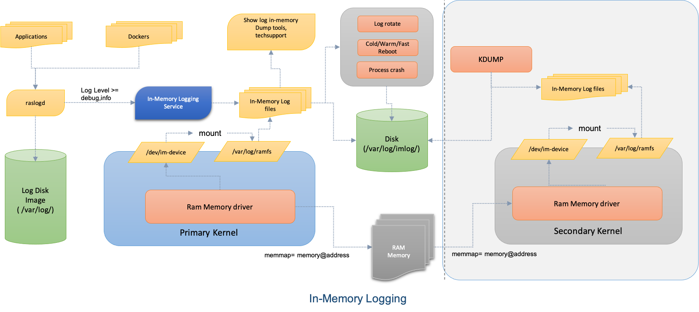

# In-Memory Logging

System logging Enhancements.

# High Level Design Document

#### Rev 0.1

# Table of Contents
 * [List of Tables](#list-of-tables)
 * [Revision](#revision)
 * [About This Manual](#about-this-manual)
 * [Scope](#scope)
 * [Definition/Abbreviation](#definitionabbreviation)
 * [Feature Overview](#FeatureOverview)
 * [Requirements](#Requirements)
 * [Design](#Design)
 * [Unit Test](#UnitTest)

# List of Tables
[Table 1: Abbreviations](#table-1-abbreviations)

# Revision
| Rev |   Date  |    Author    | Change Description        |
|:---:|:-----------:|:------------------:|-----------------------------------|
| 0.1 | 04/12/2020 |  Kalimuthu    | Initial version          |

# About this Manual

This document provides general information about In-Memory Logging feature implementation in SONiC.

# Scope

This document describes the high-level design of the In-Memory Logging Enhancement feature. 

# Definition/Abbreviation

### Table 1: Abbreviations
| **Term**         | **Meaning**             |
|--------------------------|-------------------------------------|
| ODM                      | Original Design Manufacturer        |
| SYSLOG                   | System log                          |
| KDUMP                    | Kernel Dump                         |
| RAMFS                    | Ram Memory File System              |

# 1 Feature Overview

SONiC is an open-source network operating system based on Debian Linux, integrated with various opensource applications. Each SONiC application generates logs with different log level for the events that are occurring on the system. Capturing and storing the logs from all the applications into persistent storage is essential for debugging the system events. In order to maintain the persistence of log information, every log message needs to be written into the disk log file. The continuous write of log into disk reduces the lifetime of the disk and also affect the performance of the logger. 

In order to improve the performance of the logger and increase the life of disk, the logs are divided into debug and non-debug logs. The debug Logs are called in-memory logging which will be stored into non-persistent storage called ram memory or in-memory and periodically saved them into persistent storage. All the non-debug logs are stored directly into persistent storage(Like Disk). The division of debug and non-debug log improves the life of disk as well as the performance of the logger because the log generation rate of debug log is very high compare to non-debug logs. In-memory logging feature allows the application to log both debug and non-debug messages through a unified Syslog interface which reduces the amount code change required on the application side.

## 1.1 Requirements

### 1.1.1 Functional Requirements

- It should provide a unified interface to all the SONiC applications with a different programming language to log the information so that the minimal code change is required from the application side. 
- It should leverage the existing Syslog as a unified interface for the application to log both debug and non-debug information.
- The separation of debug and non-debug logs should be based on the Log Level. 
- All the non-debug logs should be stored into persistent disk directly and stored logs should be rotated by log rotate periodically. 
- All the debug logs should be stored into in-memory first and then saved into the disk and rotated by logrotate periodically.
- All the in-memory logs should be saved into the disk when cold/fast/warm command is issued.
- In case of kernel crash, all the in-memory logs should be saved into the disk as part of kdump collection. 
- During the techsupport data collection, it should include both debug and non-debug logs. 
- Klish/Click CLI should be provided to dump and filter the logs from both debug and non debugs logs. 
- It should provide offline tools to show/filter the logs from both debug and non-debug logs.

### 1.1.2 Configuration and Management Requirements
- Klish/Click CLI is added to dump and filter the logs from both debug and non debugs logs. 

### 1.1.3 Scalability Requirements
- NA

### 1.1.4 Warm/fast/cold Boot Requirements
- When a user initiates the system reboot, all the In-Memory logs should be saved into the disk before it goes for the reboot.
 
# 2 Design
## 2.1 Overview

SONiC uses Syslog as a logging infrastructure for application to log information. In order to minimize the application code changes, the In-Memory infrastructure leverage the same existing Syslog infrastructure for application to log the debug information. The debug and non-debug information are classified through Syslog interface Log level as below. 

| **Log Level**         | **Log Value**     | **Classification**    |
|-----------------------|-------------------|-----------------------|
| LOG_EMERG             |      0            | Non-debug             |
| LOG_ALERT             |      1            | Non-debug             |
| LOG_CRIT              |      2            | Non-debug             |
| LOG_ERR               |      3            | Non-debug             |
| LOG_WARNING           |      4            | Non-debug             |
| LOG_NOTICE            |      5            | Non-debug             |
| LOG_INFO              |      6            | Debug                 |
| LOG_DEBUG             |      7            | Debug                 |

Syslog provides a uniform interface to all the languages in the SONiC applications. The application uses these log level to differentiate the debug and non-debug information form logging. 
- It uses the standard Syslog mechanism for generating the debug messages.
- Is uses standard system call syslog(LOG_DEBUG,….) for sending the logs messages.
- It provides the standard interface to all the application including C, C++, Python, Go, Shell script and Perl languages.
- It minimizes the code changes on the application side because of a unified interface.

## 2.2 Current Model

SONiC uses the rsyslog as a centralized logger for receiving and storing the logs from various SONiC applications including logs from docker applications. The Rsyslog receives the logs, process the logs if some action to be taken, and then store the logs into log file present in the /var/log/ folder from disk log partition. Some of the SONiC application adds rules in the rsyslog to separate out the application-specific logs into a separate file, for example, all the audit related log messages are stored on the separate log file as /var/log/audit.log. 

## 2.3 In-Memory Logging

The In-memory Logging feature uses the rsyslog infrastructure rules to process and store the logs into In-Memory. It doesn't require much change on the application side because it uses the same Syslog API for generating the debug information with log level as INFO or DEBUG. A simple rsyslog filter rule is added to Syslog config for filtering and storing the debug logs. 

### Kernel driver 

A block of memory is reserved from kernel physical address space during bootup and mapped into userspace as a ram block device. The ram block is mounted as a userspace ramfs for saving the in-memory contents as a file. The following kernel parameter enforces the fixed physical memory reservation in the kernel during bootup. 

         memmap=memory-size@address

A simple kernel driver is loaded in the kernel during bootup which emulates this memory area as a block device in userspace - '/dev/im-device'. 

### In-Memory

All the In-Memory logs are initially stored in the RAM memory, and then stored them into persistent storage disk periodically. The ram-block device is formatted as in ext4 filesystem and mounted as a log file system as bellow. All the files stored inside the 'ramfs' folder will be treated as an in-memory file. The rsyslog uses these log files for storing the debug information. 

        # mkfs.etx4 /dev/ramdisk
        # mount /dev/ramdisk /var/log/ramfs/

### In-memory with Kdump

During the kernel crash, all the data stored in the in-memory should be written into the persistent disk. This is done using a fixed kernel memory map. During primary kernel bootup, a fixed physical memory is reserved for in-memory storage. When secondary kernel boots up, it uses the same fixed physical memory area and maps into application space as a ramfs. Raslog-dump service is added as part of kdump collection to dump the in-memory contents from ramfs into persistent storage. 

### Rsyslog Policy

In order to separate out the debug information from Syslog, the following Rsyslog rule is added into the rsylog config. This will configure rsyslog to store all the debug logs into ramfs file system. 

        # Store all the DEBUG and INFO logs into ramfs file system.
        if $syslogseverity >= 6 then {
            /var/log/ramfs/syslog-debug.log
             stop
        }

The log format remains the same as regular Syslog format as bellow.

        # SONiC syslog default template
        $template SONiCFileFormat,"%timegenerated%.%timegenerated:::date-subseconds% %timegenerated:::date-year% %HOSTNAME% %syslogseverity-text:::uu
        ppercase% %syslogtag%%!msg1:::sp-if-no-1st-sp%%!msg1:::drop-last-lf%\n"
        $ActionFileDefaultTemplate SONiCFileFormat

## 2.4 Log Rotation Policy

The following log rotation policy is applied to all the logs stored in the in-memory and also logs that are stored in the persistent disk. The first policy enforces the log rotate to rotate the logs stored in the in-memory file system, and then it enforces the rotated logs into the disk as part of the post-rotate script. The second policy instructs the log rotate to rotate the logs within persistent storage which is same as other Syslog rotation policy.

        /var/log/ramfs/syslog-debug.log
        {
             size 1M
             rotate 2
             daily
             missingok
             notifempty
             postrotate
                cat /var/log/ramfs/syslog-debug.log.1 >> /var/log/syslog-debug.log 
                rm -f /var/log/ramfs/syslog-debug.log.1
            endscript
        }
        /var    /log/debug-syslog.log
        {
             size 1M
             rotate 100
             missingok
             notifempty
             compress
             delaycompress
             nosharedscripts
        }

When rsyslog is being restarted, all the in-memory contents should be flushed to disk. The in-memory log rotation policy is added as part of an existing Syslog rotation policy.
The log rotation happens every 2 minutes and keeps 4 weeks of log or max size of all the logs should be less than 4G. If it reaches the 4G usage, it deletes all the oldest logs in the log folder. 

## 2.5 In-Memory Logging Policy

In order to simplify the application interface and improve the logging performance, the following policies are enforced on the in-memory logging.
- Only one In-Memory logging file is prefered as this improves the performance and simplifies the in-memory logging interface and its implementation.
- Log Rotation Policy
     - Cron job to rotate the in-memory logging for every 2 minutes.
     - Size of the log file is restricted to 1mb
- Size of the In-Memory reservation from the kernel as bellow
     - 128mb on <=4GB
     - 256mb on 8GB
     - 512mb on >=16GB
- Disk write policy
     - Logs are written into the disk for every 2 minutes.
     - Logs are written into the disk when a user issues a reboot(cold/warm/fast) command.
     - During kernel panic, all the in-memory logs are written into the disk as port kdump data collection.
    
## 2.6 Tech-Support 

The techsupport script is enhanced to support the in-memory log collection as well. During the tech-support collection, all the in-memory logs are included as part of regular Syslog collection.

- All the logs from in-memory.
- All the logs which are already stored in the persistent disk.

## 2.7 In-Memory Dump Tools

A utility is provided to dump and filter the logs from in-memory as well as Syslog. The in-memory logs should be accessed in the following order to get the log timing sequence.

1. /var/log/ramfs/debug-in-memory.log
2. /var/log/syslog-debug.log
3. /var/log/syslog-debug.log.1
4. /var/log/syslog-debug.log.2.gz, ...

## 2.8 KLISH/CLICK Commands

The following CLI commands are supported to dump the logs from in-memory.

- Show all the logs from In-Memory contents.

         # show log in-memory 
 
- Show logs from both standard Syslog and in-memory with the sequence of timestamp.

         # show log all 

## 2.9 Cold/Warm/Fast Reboot

During the system reboot, all the In-Memory logs should be stored on the persistence disk. When a user initiates a system reboot command, the following sequence gets executed.

1. Append the contents of In-Memory into persistence storage file - /var/log/in-memory-debug.log. 
2. Reset the In-Memory file pointer.
3. Let the reboot script to continue. 
4. Just before the reboot, repeat step 1 and 2 again. 

## 3.0 Kernal Crash 

During the kernel crash, all the In-memory logs should be saved into /var/log folder as part of kdump data collection. When kernel crash happens the following action sequence gets executed.
1. During the kernel bootup, it reserves the same physical memory used in the primary kernel.
2. Insert the ramdisk driver for emulating the reserved physical memory as a ram block device in the userspace.
3. During the In-Memory service startup, mount the ram block device as ramfs into /var/log/ramfs folder.
4. As part of the kdump data collection, copy the contents of in-memory contents into /var/log/ folder.
5. reboot the system. 

# 3 Unit Test

|SNO|  Testcase                                                        | Result  |
|---|------------------------------------------------------------------| ------- |
| 1 | Verify the In-memory logging memory reservation                  |         |
| 2 | Verify the reserved memory block mounted as ramfs                |         | 
| 3 | Verify the In-memory logging entry through rsyslog               |         |
| 4 | Verify the In-memory contents are stored into the disk for every 2 minutes | |
| 5 | Verify the In-memory log files stored on the disk are rotated    |         |
| 6 | Verify the In-memory contents are saved into disk during system reboot |   |
| 7 | Verify the In-memory contents are saved into disk during kernel panic |    |
| 8 | Verify the show commands for both Im-memory and regular Syslog  |          |
| 9 | Verify the techsupport that includes both In-memory and regular Syslog contents ||
| 10 | Verify the In-memory dump utils                                 |         |

End

